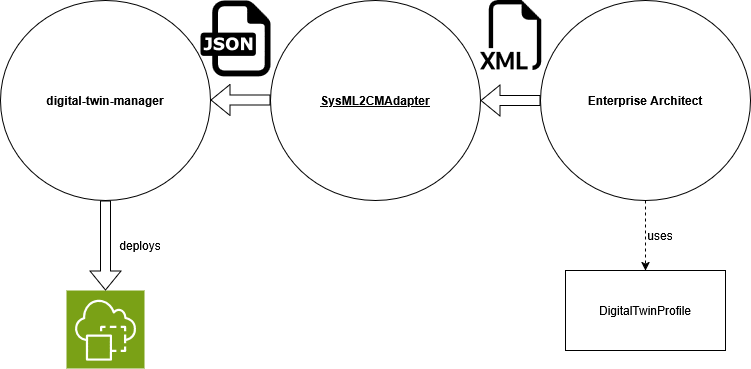
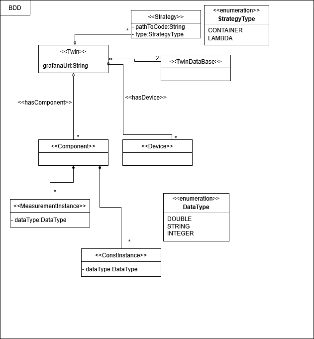
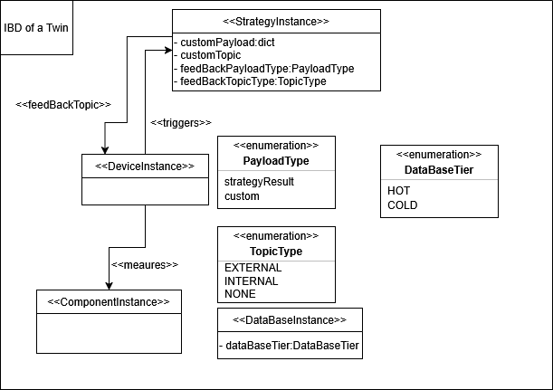

# Documentation

## Prerequisites

### Technologies
- **Java 25**
- **XMI 2.1 file** containing a **SysML v1 model** exported from *Enterprise Architect*² and annotated with the **DigitalTwinProfile**.  
  This file serves as the input for the program.

## Architecture

The purpose of this tool is to parse a SysML model annotated with the **DigitalTwinProfile** and convert it into a structure that serves as input for the **digital-twin-manager**¹, which deploys digital twins to AWS.

### Input Requirements
- **Twin name** (maximum length: 10 characters)
- **XMI 2.1 model file** from *Enterprise Architect*², annotated with the **DigitalTwinProfile**

---

## The DigitalTwinProfile

The DigitalTwinProfile extends the standard **SysML v1 profile** with additional stereotypes required to construct a deployable digital twin.

### Block Definition Diagram (BDD)

The figure illustrates the BDD view. The following stereotypes extend SysML Blocks and are placed in the BDD:

- **Twin**  
  Marks a SysML Block as a Twin (e.g., `ECar`). A Twin may contain:
    - **Component**  
      Marks a SysML Block as a component (e.g., `Engine`).  
      Components may contain annotated attributes:
        - **MeasurementInstance**
            - Tagged Values:
                - `dataType`
        - **ConstInstance**
            - Tagged Values:
                - `dataType`
            - Has a value set directly in Enterprise Architect.
    - **Device**  
      Marks a SysML Block as a device (e.g., a sensor).
    - **Strategy**  
      Marks a SysML Block as a strategy to be executed on AWS.
        - Tagged Values:
            - `pathToCode`
            - `strategyType` (`LAMBDA` or `CONTAINER`)
    - **TwinDataBase**

#### Connectors (BDD)
The following connectors extend the SysML Aggregation Connector:

- **hasComponent** – A Twin may have multiple Components
- **hasDevice** – A Twin may have multiple Devices
- **hasStrategy** – A Twin may have multiple Strategies

A direct connection between **Twin** and **TwinDataBase** is not required; they only need to belong to the same Twin.  
A Twin may contain **at most two databases**.

---

### Internal Block Diagram (IBD)

The IBD view defines the internal structure of the Twin.
This is the actual content in AWS.

The following stereotypes are provided:

- **ComponentInstance**  
  Marks a SysML part within a Twin as a component instance.  
  A component instance may override values of `ConstInstance`.
- **DeviceInstance**  
  Marks a SysML part as a device instance, capable of triggering multiple strategies or measurements.
- **StrategyInstance**  
  Marks a SysML part as a strategy instance, with the following tagged values:
    - `feedBackPayloadType`:
        - `strategyResult` – returns the strategy’s result
        - `custom` – custom defined return value
    - `feedBackTopicType`:
        - `EXTERNAL` – sends the result to an external topic
        - `INTERNAL` – uses the connector endpoint as the topic
        - `NONE` – result is ignored
    - `customPayload`
    - `customTopic`
- **DataBaseInstance**  
  Tagged Values:
    - `dataBaseTier`:
        - `HOT`
        - `COLD`  
          Exactly two databases are allowed per Twin: one HOT and one COLD.

#### Connectors (IBD)
- **measures**
    - Tagged Values:
        - `measurement` – reference to a `MeasurementInstance` of a Component  
          A `DeviceInstance` may measure **at most one** `ComponentInstance`.

- **triggers**
    - Tagged Values:
        - `lhsProperty` – reference to a `MeasurementInstance` or `ConstInstance`
        - `rhsProperty` – same type as `lhsProperty`
        - `operator` – e.g. `<`, `>`, etc.

- **feedBackTopic**
    - Used when `feedBackTopicType = INTERNAL`.  
      The connector endpoint determines the internal topic.

---

## Functionality of the Tool

The tool converts the annotated SysMl model into the target structure required by the deployment tool.  
For consistent mapping between Enterprise Architect and AWS, the **xmi:idref** of each model element is used as the identifier.  
Because AWS requires shorter identifiers, IDs are shortened in a backward-compatible manner.
---

## References
[1] digital-twin-manager: https://github.com/cloud-DTs/digital-twin-manager/tree/main  
[2] Enterprise Architect by Sparx Systems: https://sparxsystems.com/

